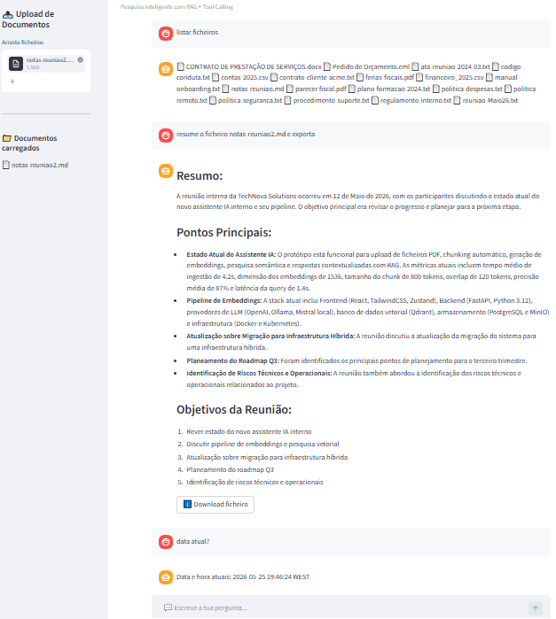
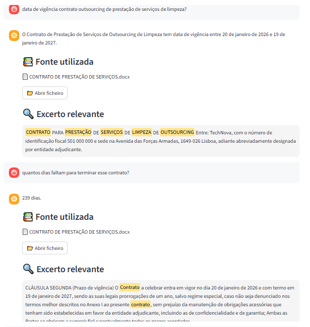
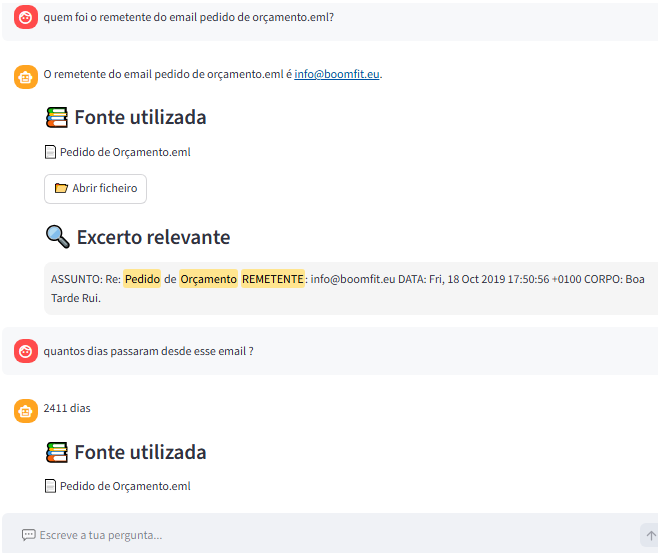
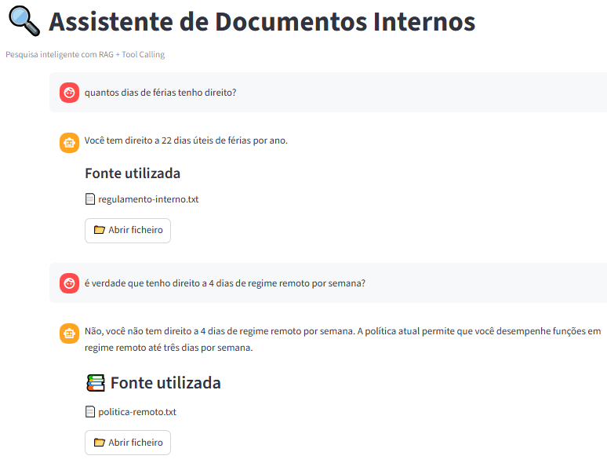
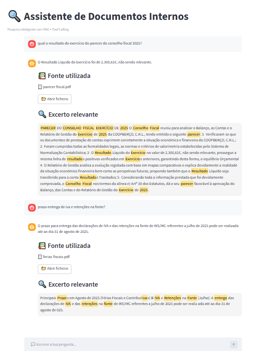
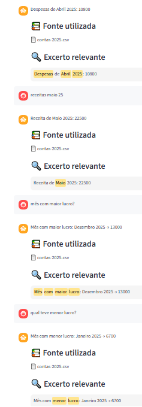
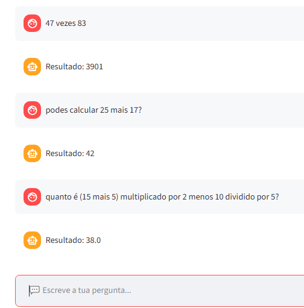

# Overview

This project is a **fully local and privacy-first AI document assistant** that combines **Retrieval-Augmented Generation (RAG)**, an interactive **chatbot interface**, and **rule-based tool routing** to provide intelligent retrieval and analysis of internal documents.

The system runs entirely offline using **local LLMs through Ollama**, ensuring **zero external API dependency** and **no data leakage**.

It was specifically designed for environments with **limited computational resources** (~2GB available RAM and no dedicated GPU), where only lightweight models can realistically operate.

Since smaller models often struggle with reliable native **tool calling**, the architecture introduces a **deterministic routing layer** capable of invoking specialized local tools instead of relying exclusively on model-native tool calling.

The system introduces a **rule-based runtime LLM-agent** responsible for routing requests toward specialized local tools or semantic retrieval pipelines.

This enables:

- Secure and private AI workflows
- Predictable and traceable behavior
- Reduced hallucinations
- Lower computational requirements
- Efficient execution on weak hardware
- Practical AI deployment without cloud infrastructure

Supported capabilities include:

- Semantic document search
- Contextual RAG responses
- Automatic document summarization
- Temporary in-session document analysis without persistent storage
- Deadline calculations and elapsed time tracking
- Date/time operations
- Document listing
- Natural language mathematical calculations
- Intelligent CSV querying
- Result exporting
- Grounded responses with source attribution and direct document access and reading

The architecture combines:

- Retrieval-Augmented Generation (RAG)
- Semantic embeddings
- Vector retrieval pipelines
- Cosine similarity search
- Chunking with overlap
- Hybrid reranking
- MD5-based metadata management
- Rule-based LLM-agent orchestration
- Deterministic tool routing
- Local tool execution (`tools/*.py`)

The project demonstrates that thoughtful architecture and **LLM-agent orchestration** can compensate for model limitations, enabling useful AI systems even under constrained hardware conditions.

---

# Features

## Chatbot Interface

- Streamlit chatbot UI
- Multi-document format upload
- Full conversation history
- Automatic indexing after upload
- MD5-based file change detection
- Automatic index cleanup after deletion
- Source attribution
- Optional access to original files
- Automatic extraction of relevant snippets
- Keyword highlighting
- Visual feedback for response confidence

---

## Search & Retrieval

- Semantic search using embeddings
- RAG (*Retrieval-Augmented Generation*)
- Vector similarity search
- Chunking with overlap

Hybrid reranking:

- Vector similarity
- Keyword matching

---

## Streamlit Interface



---

## Supported Formats

- `.txt`
- `.pdf`
- `.docx`
- `.csv`
- `.md`
- `.eml`

---

# Architecture / Orchestration

Simplified flow:

```text
Document Upload
      ↓
Text extraction
      ↓
Chunking (300 words + overlap)
      ↓
Embeddings (Ollama)
      ↓
Vector indexing
      ↓

Store:

chunks.json
vectors.npy
metadata

      ↓

User question
      ↓
Router / Agent
      ↓

Decision:

→ Tool?

- calculations
- date operations
- summaries
- exports
- document reading
- CSV queries

OR

→ RAG retrieval
      ↓
Question embedding
      ↓
Vector search
      ↓
Hybrid reranking
      ↓
Context construction
      ↓
LLM
      ↓
Response + source
```

---

# Tool Routing

The system uses a deterministic routing layer that automatically decides whether a request requires:

- Local tools
- RAG retrieval
- Summarization
- Mathematical calculations
- Date operations
- Structured CSV analysis via pandas

The architecture currently does **not rely on native model function calling (`/api/chat`)**.

Instead, routing is handled by a **Python runtime layer optimized for small local models**.

Future versions may introduce **native LLM tool calling** when larger hardware resources become available.

---

# Example: Deadline Questions



Execution flow:

```text
Question
    ↓
RAG retrieval
    ↓
Relevant chunk recovery
    ↓
Context building
    ↓
Temporal intent detection
    ↓
Automatic date extraction
    ↓
calculate_remaining_days()
    ↓
Temporal result added to context
    ↓
LLM final response
```
# Mores Examples: eml, txt, pdf

## EML Workflow — Context Retrieval + Temporal Reasoning + Summarization + Export



Demonstrates a multi-step interaction using an `.eml` document where the system combines semantic retrieval and specialized tools.

Capabilities shown:

- Extraction of structured email metadata (sender, date, subject) and full content parsing
- Temporal reasoning ("How many days ago was this email sent?")
- Automatic document summarization and exporting generated responses (exports/ directory)
- Implicit contextual memory for reference resolution and context-aware follow-up interactions (e.g., “this email”)

Email files are particularly challenging because they often contain significant noise and unstructured content, including:

- Headers and metadata
- Email signatures
- Quoted replies
- Automatic disclaimers
- Formatting artifacts
- Redundant conversational history

Despite this noisy structure, the system successfully extracted relevant information, identified context, performed temporal reasoning, generated summaries, and maintained coherent interactions. The outcome is especially noteworthy given the use of a small local language model operating on constrained hardware.

This example demonstrates that a carefully designed architecture combining semantic retrieval and deterministic tool routing can offset many of the limitations typically associated with lightweight models, allowing useful AI-assisted document analysis.

---

## TXT Document — RAG-based Question Answering



Example of contextual retrieval from a `.txt` document using RAG pipeline.

Capabilities shown:

- Semantic document search
- Context retrieval
- Source traceability and direct document navigation

---

## PDF Document — Semantic Retrieval + Context Grounding



Example of question answering over indexed `.pdf` documents.

Capabilities shown:

- PDF content extraction
- Source-based response generation with direct document access
- Response grounding using retrieved chunks

---

### Intelligent CSV querying



- Natural language queries over CSV data
- Business and financial information retrieval
- Time-period filtering
- Source attribution
- Relevant snippet extraction

### Natural Language Math Calculations



- Interpretation of natural language mathematical queries
- Deterministic tool execution
- Accurate calculations without relying on LLM reasoning

---

# Model Personalization — Modelfile vs Fine-tuning

A custom **Ollama Modelfile** was used to shape model behavior.

Observed improvements:

### Without Modelfile

- 📄 [Without Modelfile](exports/resposta_1.txt)

- Noisy summaries
- Inconsistent formatting
- Unnecessary text
- Weaker synthesis

### With Modelfile

- 📄 [With Modelfile](exports/resposta_2.txt)

- Cleaner summaries
- Structured outputs
- Explicit source attribution
- Stronger information compression

---

# Final Reflections

The project achieved useful results despite extremely modest hardware constraints.

The modular separation between interface, runtime, and tools simplified maintenance and future evolution.

The use of a **controlled runtime agent** revealed practical advantages in **predictability**, **traceability**, and **operational control** when compared to fully autonomous agent architectures.

Explicit rule-based execution also simplified validation, debugging, and auditing of system behavior, which can be particularly valuable in privacy-sensitive or production-oriented environments.

A future hybrid approach could combine **deterministic rules** with greater **contextual decision-making capabilities** and more intelligent **tool chaining by the model itself**, enabling increased flexibility for scenarios where dynamic behavior becomes beneficial in production environments, provide a practical balance between control and autonomy.

Most importantly, it demonstrates that practical **Private AI**, **Local LLMs**, **Ollama**, and **LLM-agent workflows** can be achieved without expensive infrastructure when architecture is carefully designed.


---

# Installation

Create a virtual environment:

```bash
python -m venv venv
```

Activate it:

### Windows

```bash
venv\Scripts\activate
```

### Linux / macOS

```bash
source venv/bin/activate
```

Install dependencies:

```bash
pip install -r requirements.txt
```

---

# Main Dependencies

Core libraries used by the project:

- streamlit
- numpy
- requests
- pypdf
- python-docx
- pandas
- beautifulsoup4

---

# Ollama Setup

Make sure Ollama is installed and running:

```bash
ollama serve
```

Download required models:

```bash
ollama pull nomic-embed-text
ollama pull qwen2.5:3b
```

---

# Models Used

## Embedding Model

```text
nomic-embed-text
```

Used for:

- Document embeddings
- Question embeddings
- Semantic search
- Vector retrieval

---

## LLM Model

```text
qwen2.5:3b
```

Used for:

- RAG responses
- Document summarization
- Final response generation
- Context-based reasoning

This model was selected due to hardware constraints and low memory requirements.

Alternative compatible models:

- qwen2.5:7b
- llama3
- mistral
- gemma
- deepseek

Larger models may improve:

- tool selection
- contextual reasoning
- follow-up handling
- response quality

at the expense of increased computational requirements.

---

# Running the Project

### Index documents

```bash
python indexar.py
```

### Command-line mode

```bash
python perguntar.py "What is the vacation policy?"
```

### Launch graphical interface

```bash
streamlit run app.py
```
---

## License

This project is proprietary. Any use, modification, or distribution requires prior contact and explicit permission from the author.